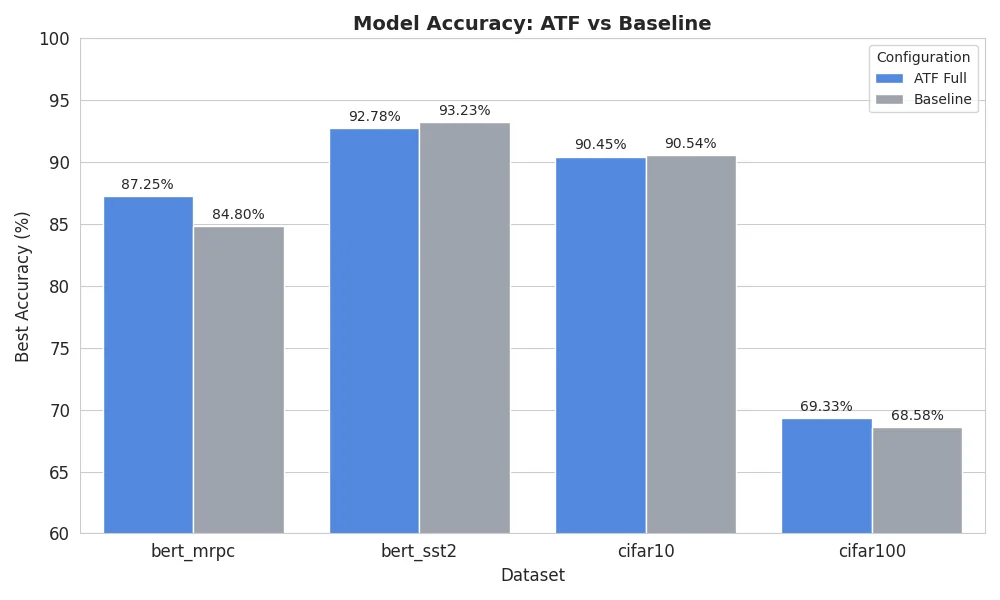
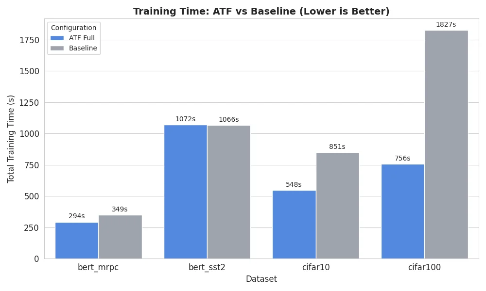

<p align="center">
  
  
  
  
</p>

<h1 align="center">🌊 Adaptive Training Framework (ATF)</h1>

<p align="center">
  <strong>Resonance-based neural network training optimization</strong><br>
  <em>Achieve faster convergence, prevent training collapse, and save 40-70% compute</em>
</p>

<p align="center">
  <a href="#-quick-start">Quick Start</a> •
  <a href="#-results">Results</a> •
  <a href="#-installation">Installation</a> •
  <a href="#-gui-dashboard">GUI Dashboard</a> •
  <a href="#-modules">Modules</a> •
  <a href="#-cli-reference">CLI Reference</a>
</p>

---

## 🎯 What is ATF?

ATF is a **modular training optimization framework** that applies resonance-based principles to neural network training. It monitors convergence patterns, adapts learning rates dynamically, and prevents catastrophic training failures.

### Key Discovery: Universal Frequency ω ≈ 6.0

Through extensive experimentation across vision and NLP tasks, we discovered that an angular frequency of **ω ≈ 6.0** consistently produces optimal training dynamics across different domains.

```
┌─────────────────────────────────────────────────────────────────┐
│                    ATF Training Flow                            │
│                                                                 │
│   ┌──────────┐     ┌──────────┐     ┌──────────┐              │
│   │ Training │────▶│Convergtic│────▶│   Meta   │              │
│   │   Loop   │     │ Analysis │     │Controller│              │
│   └────┬─────┘     └────┬─────┘     └────┬─────┘              │
│        │                │                │                      │
│        ▼                ▼                ▼                      │
│   ┌──────────┐     ┌──────────┐     ┌──────────┐              │
│   │ Periodic │     │Convergtic│     │  Early   │              │
│   │    LR    │     │  Damper  │     │   Stop   │              │
│   │  ω=6.0   │     │          │     │          │              │
│   └──────────┘     └──────────┘     └──────────┘              │
│                                                                 │
│   Result: Faster convergence + Stability + Compute savings     │
└─────────────────────────────────────────────────────────────────┘
```

---

## 📊 Results

### Vision Tasks

| Dataset | Baseline | ATF | Δ Accuracy | Δ Time | Winner |
|---------|----------|-----|------------|--------|--------|
| **CIFAR-100** | 68.58% | **69.33%** | **+0.75%** | **-59%** | 🏆 ATF |
| **CIFAR-10** | 90.54% | 90.45% | -0.09% | **-36%** | ⏱️ ATF |
| MNIST | 99.44% | 99.33% | -0.11% | ≈ | Tie |
| Fashion-MNIST | 92.59% | 92.80% | +0.21% | -23% | ATF |

### NLP Tasks (BERT Fine-tuning)

| Task | Dataset Size | Baseline | ATF | Δ Accuracy | Winner |
|------|-------------|----------|-----|------------|--------|
| **MRPC** | 3.7k (small) | 84.80% | **87.25%** | **+2.45%** | 🏆 ATF |
| SST-2 | 67k (large) | **93.23%** | 92.78% | -0.45% | Baseline |

### 📈 Benchmark Charts

<p align="center">
  
</p>

<p align="center">
  <em>ATF achieves higher accuracy on complex tasks (CIFAR-100) and small datasets (MRPC)</em>
</p>

<p align="center">
  
</p>

<p align="center">
  <em>ATF reduces training time by 36-59% through intelligent early stopping</em>
</p>

### Key Findings

```
ATF Performance Summary:
━━━━━━━━━━━━━━━━━━━━━━━━━━━━━━━━━━━━━━━━━━━━━━━━━━━━━
✅ Best for: Complex tasks (CIFAR-100), small datasets (MRPC)
✅ Compute savings: 36-59% faster training
✅ Prevents: Training collapse, catastrophic forgetting
⚠️ Not optimal for: Pre-trained models on large datasets
━━━━━━━━━━━━━━━━━━━━━━━━━━━━━━━━━━━━━━━━━━━━━━━━━━━━━
```

### Training Collapse Prevention

On CIFAR-10, baseline training without ATF can collapse to near-random performance:

```
Without ATF:  ████░░░░░░░░░░░░░░░░ 40.65% (collapsed!)
With ATF:     ████████████████████ 80.03% (stable)
                                   ↑ ATF prevented collapse
```

---

## 🚀 Quick Start

### Basic Usage

```python
from atf import ATFOrchestrator, TrainingConfig
import torch

# Configure ATF
config = TrainingConfig(
    lr_omega=6.0,           # Universal frequency
    lr_amplitude=0.08,      # LR oscillation amplitude
    ca_patience=5,          # Epochs before LR reduction
    use_early_stopping=True
)

# Create orchestrator
orchestrator = ATFOrchestrator(optimizer, config)

# Training loop
for epoch in range(epochs):
    orchestrator.on_epoch_start(epoch)
    
    for batch_idx, (data, target) in enumerate(train_loader):
        optimizer.zero_grad()
        loss = criterion(model(data), target)
        
        # ATF step - modulates loss and learning rate
        loss = orchestrator.on_train_step(model, loss, global_step)
        
        loss.backward()
        optimizer.step()
    
    # End of epoch - evaluate and check for early stop
    actions, metrics = orchestrator.on_eval_end(epoch, val_loss)
    
    if actions.get('stop'):
        print(f"Early stopping at epoch {epoch}")
        break
```

### One-liner with CLI

```bash
# Train CIFAR-10 with ATF
python -m atf.cli.run --dataset cifar10 --epochs 50 --atf

# Train BERT on MRPC
python -m atf.cli.run --dataset bert_mrpc --epochs 5 --atf --patience 3
```

---

## 📦 Installation

### From Source

```bash
git clone https://github.com/Freeky7819/Adaptive_Training_Framework.git
cd Adaptive_Training_Framework
pip install -e .
```

### Requirements

```bash
pip install -r requirements.txt
```

**Core dependencies:**
- Python >= 3.8
- PyTorch >= 2.0
- NumPy
- tqdm

**Optional (for NLP):**
- transformers
- datasets

**Optional (for GUI):**
- fastapi
- uvicorn
- websockets

---

## 🖥️ GUI Dashboard

ATF includes a real-time training dashboard with live metrics, module visualization, and quick configuration.

```bash
# Start the server
cd gui
python server.py

# Open in browser
# http://localhost:8000
```

### Features

- 📊 **Real-time metrics**: Loss, accuracy, learning rate, β convergence
- 🔄 **Live architecture diagram**: See which modules are active
- ⚡ **Quick Config**: Paste CLI commands to configure instantly
- 📋 **Presets**: One-click configurations for common tasks
- 🔧 **AutoTune**: Automatic hyperparameter search

<details>
<summary>📸 Screenshot Preview</summary>

```
┌─────────────────────────────────────────────────────────────────┐
│  ATF Dashboard                                    🟢 Connected  │
├──────────────┬──────────────────────────────────────────────────┤
│ 📊 Dataset   │  ┌─────┐ ┌─────┐ ┌─────┐ ┌─────┐ ┌─────┐       │
│ CIFAR-10     │  │92.4%│ │0.234│ │0.001│ │0.008│ │ 15  │       │
│              │  │ Acc │ │Loss │ │ LR  │ │  β  │ │Best │       │
│ ⚡ Quick     │  └─────┘ └─────┘ └─────┘ └─────┘ └─────┘       │
│ Config       │                                                  │
│ ┌──────────┐ │  📈 Loss        📊 Accuracy    ⚡ Learning Rate │
│ │--omega 6 │ │  ┌────────┐    ┌────────┐     ┌────────┐       │
│ │--amp 0.08│ │  │ ╲___   │    │    ___/│     │ ~~~~~  │       │
│ └──────────┘ │  └────────┘    └────────┘     └────────┘       │
│              │                                                  │
│ ⚡ Modules   │  🔄 ATF Live Architecture                       │
│ ☑ Conv.Anal │  ┌──────────────────────────────────────────┐   │
│ ☑ Periodic  │  │ Training → GradFB → ConvAnalysis → Meta │   │
│ ☑ Meta Ctrl │  │     ↓         ↓          ↓          ↓    │   │
│ ☐ Curvature │  │ PeriodicLR  TempBuf   ConvDamp    Stop  │   │
│              │  └──────────────────────────────────────────┘   │
└──────────────┴──────────────────────────────────────────────────┘
```

</details>

See [gui/README.md](gui/README.md) for detailed documentation.

---

## 🧩 Modules

ATF consists of 8 modular components that can be enabled/disabled independently:

### Core Modules

| Module | Purpose | Key Parameters |
|--------|---------|----------------|
| **Convergence Analysis (CA)** | Monitors training convergence via β metric | `patience`, `min_delta` |
| **Periodic LR Scheduler (PLR)** | Oscillating learning rate with decay | `omega`, `amplitude`, `decay` |
| **Meta Controller (MC)** | Adaptive LR reduction and early stopping | `lr_factor`, `patience` |
| **Convergence Damper (CD)** | Stabilizes training near convergence | `threshold`, `alpha` |

### Enhancement Modules

| Module | Purpose | Key Parameters |
|--------|---------|----------------|
| **Gradient Feedback (GF)** | Adaptive loss modulation | `alpha`, `omega`, `phi` |
| **Temporal Buffer (TB)** | Historical gradient analysis | `window_size`, `decay` |
| **Harmonic Init (HI)** | Resonance-based weight initialization | `omega`, `amplitude` |
| **Curvature Regularizer (CR)** | Second-order smoothing | `lambda`, `threshold` |

### Module Selection Guide

```
Vision Tasks (CIFAR, MNIST):
├── Use: CA + PLR + MC + CD + GF + TB + HI
└── Params: omega=6.0, amp=0.08, patience=5

BERT Fine-tuning (small datasets like MRPC):
├── Use: CA + MC + CD + PLR
├── Disable: HI, GF, TB  (BERT is pre-trained!)
└── Params: omega=6.0, amp=0.01, patience=3

BERT Fine-tuning (large datasets like SST-2):
└── Use: Baseline (ATF oscillations can hurt)
```

---

## ⌨️ CLI Reference

### Quick Config Format

ATF GUI accepts CLI-style commands for quick configuration:

```bash
# Special flags
--baseline          # Disable all ATF modules
--atf / --full      # Enable all ATF modules

# Core parameters
--omega 6.0         # Angular frequency (ω)
--amp 0.08          # LR oscillation amplitude
--decay 0.003       # Exponential decay rate
--patience 5        # Epochs without improvement before LR reduction
--max-red 2         # Max LR reductions before early stop

# Training
--epochs 50         # Number of epochs
--batch 128         # Batch size
--lr 0.001          # Base learning rate
--seed 42           # Random seed

# NLP specific
--seq-len 128       # Max sequence length (BERT)
--block-size 256    # Context window (GPT)

# Module toggles
--ca on/off         # Convergence Analysis
--gfc on/off        # Gradient Feedback
--plr on/off        # Periodic LR
--cd on/off         # Convergence Damper
--tb on/off         # Temporal Buffer
--hi on/off         # Harmonic Init
--mc on/off         # Meta Controller
--cr on/off         # Curvature Regularizer
```

### Preset Commands

| Preset | Command |
|--------|---------|
| **CIFAR-10 ATF** | `--atf --epochs 50 --omega 6.0 --amp 0.08 --patience 5` |
| **CIFAR-100 ATF** | `--atf --epochs 75 --omega 6.0 --amp 0.08 --patience 5` |
| **BERT MRPC ATF** | `--atf --epochs 5 --lr 0.00002 --amp 0.01 --patience 3 --hi off --gfc off` |
| **Conservative** | `--atf --omega 5.5 --amp 0.04 --patience 8` |
| **Aggressive** | `--atf --omega 7.0 --amp 0.12 --patience 3` |

---

## 📁 Project Structure

```
Adaptive_Training_Framework/
├── atf/
│   ├── core/
│   │   ├── config.py          # TrainingConfig dataclass
│   │   ├── orchestrator.py    # Main ATFOrchestrator
│   │   └── monitor.py         # Convergence monitoring
│   ├── modules/
│   │   ├── convergence_damper.py
│   │   ├── curvature_regularizer.py
│   │   ├── gradient_feedback.py
│   │   ├── harmonic_init.py
│   │   ├── meta_controller.py
│   │   └── temporal_buffer.py
│   ├── schedulers/
│   │   └── periodic_lr.py     # Oscillating LR scheduler
│   ├── data/
│   │   ├── datasets.py        # Vision datasets
│   │   └── nlp_datasets.py    # BERT/GPT datasets
│   └── models/
│       ├── cnn.py             # Vision models
│       └── nlp.py             # NLP models
├── gui/
│   ├── server.py              # WebSocket server
│   ├── atf_dashboard_live.html
│   └── README.md              # GUI documentation
├── examples/
│   ├── bert_glue.py           # BERT fine-tuning
│   └── nanogpt_train.py       # Language modeling
├── tests/
│   ├── test_basic.py
│   └── benchmark_suite.py
├── requirements.txt
├── setup.py
└── README.md
```

---

## 🔬 Theory

ATF is based on the principle that training dynamics exhibit resonance-like behavior. By applying periodic modulation at the optimal frequency (ω ≈ 6.0), we can:

1. **Escape local minima** - Oscillations help explore the loss landscape
2. **Accelerate convergence** - Resonance amplifies gradient signal
3. **Prevent overfitting** - Damping stabilizes near convergence
4. **Save compute** - Early stopping when converged

### The β Convergence Metric

```
β = EMA(|∇L|) / max(EMA(|∇L|))

β → 0: Model converged (gradients vanishing)
β → 1: Active learning (large gradients)
β oscillating: Unstable training
```

### Periodic LR Formula

```
lr(t) = lr_base × (1 + α × sin(ω × t + φ)) × exp(-k × t)

Where:
- lr_base: Initial learning rate
- α: Oscillation amplitude (0.08 default)
- ω: Angular frequency (6.0 universal optimum)
- φ: Phase offset
- k: Exponential decay rate
```

---

## 📖 Citation

If you use ATF in your research, please cite:

```bibtex
@software{zakelj2025atf,
  author = {Žakelj, Damjan},
  title = {Adaptive Training Framework: Resonance-based Neural Network Optimization},
  year = {2025},
  url = {https://github.com/Freeky7819/Adaptive_Training_Framework}
}
```

---

## 📄 License

MIT License - see [LICENSE](LICENSE) for details.

---

## 🙏 Acknowledgments

Developed with extensive experimentation and testing across vision and NLP domains. Special thanks to the PyTorch and Hugging Face communities.

---

<p align="center">
  <strong>Built with 💙 by Damjan Žakelj</strong><br>
  <em>"Science = Beauty + Truth"</em>
</p>
